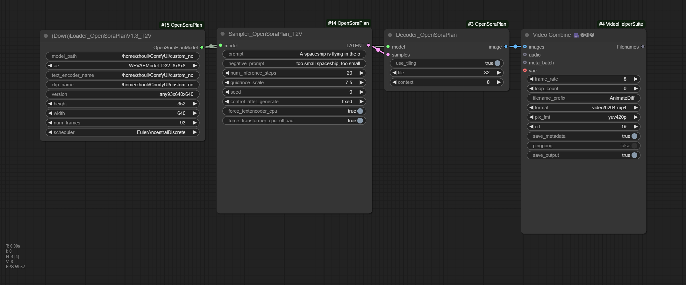

## ComfyUI-OpenSoraPlan

Another comfy implementation for the short video generation project PKU-YuanGroup/Open-Sora-Plan, supporting latest 1.3.0 and 1.2.0 and image to video feature, etc.

Please be aware that PKU-YuanGroup/Open-Sora-Plan and hpcaitech/Open-Sora are two distinct code bases. They are seperate attempts to reproduce OpenAI's close source Sora project.

## Installation
```
cd ComfyUI/custom_nodes
git clone https://github.com/bombax-xiaoice/ComfyUI-OpenSoraPlan
pip3 install -r ComfyUI-OpenSoraPlan/requirements.txt
```
_only added huggingface_hub to the original requirements.txt from PKU-YuanGroup/Open-Sora-Plan_

One may pre-download the following models under custom_nodes/ComfyUI-OpenSoraPlan/models/ for latest V1.3. Or just wait the first run of (Down)Loader to fetch them automatically
```
mkdir ComfyUI-OpenSoraPlan/models/
huggingface-cli download LanguageBind/Open-Sora-Plan-v1.3.0 --local-dir ComfyUI-OpenSoraPlan/models/Open-Sora-Plan-v1.3.0
huggingface-cli download google/mt5-xxl --local-dir ComfyUI-OpenSoraPlan/models/mt5-xxl
huggingface-cli download laion/CLIP-ViT-bigG-14-laion2B-39B-b160k --local-dir ComfyUI-OpenSoraPlan/models/CLIP-ViT-bigG-14-laion2B-39B-b160k
```
Legacy versions need some more files to be downloaded, or just wait for the first run of (Down)Loader to fetch them automatically
```
huggingface-cli download LanguageBind/Open-Sora-Plan-v1.2.0 --local-dir ComfyUI-OpenSoraPlan/models/Open-Sora-Plan-v1.2.0
huggingface-cli download LanguageBind/Open-Sora-Plan-v1.1.0 --local-dir ComfyUI-OpenSoraPlan/models/Open-Sora-Plan-v1.1.0
huggingface-cli download LanguageBind/Open-Sora-Plan-v1.0.0 --local-dir ComfyUI-OpenSoraPlan/models/Open-Sora-Plan-v1.0.0
huggingface-cli download google/t5-v1_1-xxl --local-dir ComfyUI-OpenSoraPlan/models/t5-v1_1-xxl
```


## Nodes and Models Mapping

| Version | Loader Node | Sampler Node | Decoder Node | Models |
| ------- | ----------- | ------------ | ------------ | ------- | 
| 1.3 I2V | (Down)Loader_OpenSoraPlanV1.3_Image2Video | Sampler_OpenSoraPlanV1.3_I2V | Decoder_OpenSoraPlan | any93x640x640_i2v |
| 1.3 T2V | (Down)Loader_OpenSoraPlanV1.2_Text2Video | Sampler_OpenSoraPlan_T2V | Decoder_OpenSoraPlan | any93x640x640 |
| 1.2 I2V | Legacy/(Down)Loader_OpenSoraPlanV1.2_I2V | Legacy/Sampler_OpenSoraPlanV1.2_I2V | Decoder_OpenSoraPlan | 93x480p_i2v |
| 1.2 T2V | Legacy/(Down)Loader_OpenSoraPlanV1.2_T2V | Sampler_OpenSoraPlan_T2V | Decoder_OpenSoraPlan | 93x720p 93x480p 29x720p 29x480p 1x480p |
| 1.1 T2V | Legacy/(Down)Loader_OpenSoraPlanV1.1_T2V | Sampler_OpenSoraPlan_T2V | Decoder_OpenSoraPlan | 221x512x512 65x512x512 |
| 1.0 T2V | Legacy/(Down)Loader_OpenSoraPlanV1.0_T2V | Sampler_OpenSoraPlan_T2V | Decoder_OpenSoraPlan | 65x512x512 65x256x256 17x256x256 |

model files can be automatically downloaded from huggingface to custom_nodes/ComfyUI-OpenSoraPlan/models/ under comfy home directory

## Tips

1. In case of low GPU memory, turning on `force_textencoder_cpu` will run text encoder on CPU. Turning on `force_transformer_cpu_offload` will load transformer into cpu first and converted to gpu block by block. Turning on `force_vae_cpu_offload` in image-to-video sampler will offload vae to cpu after encoding reference image(s) to latent.

2. To further save running GPU memory, one can further turn on `use_tiling` in decoder and/or encoder (only available for image-to-video sampler) to process data in smaller spatial + temporal blocks. `tile` defines the latent size (both height and width) of each blocks spatially. For instance, regarding OpenSoraPlanV1.3, if output size is set to 480x480 and tile=24 (coressponding image size of each blocks is 192x192), and the default overlap ratio is 0.25. then each frame is spatially split into the following tiles: [0:192,0:192], [0:192,144:336], [0:192,288:480], [144:336,0:192], [144:336,144:336], [144:336,288:480], [288:480,0:192], [288:480,144:336], [288:480,288:480]. `context` defines the frame count of each latent block temporally, the actual frame count in each video block is about 2 times or 4 times the value of `context`. One can also set `tile=0` which only enable temporal tiling and disable spatial tiling.

3. OpenSoraPlanV1.3 Text-to-Video allow reference images to be one image (starting frame), two images (starting and ending frames) or a video clip (interpolation). One can provide one filename or a list of filenames with comma delimeters via input `imagefiles` directly (internal codes use file). Alternatively, for better compatibilities, the ComfyUI's IMAGE type input is also allowed via input `images`, where temp files are created under /dev/shm/ or /tmp/ before being passed into internal codes.

4. OpenSoraPlanV1.2 Text-to-Video allow either one `start_image`, or a pair of `start_image` and `end_image` as reference. Both in ComfyUI's IMAGE type.

5. Original implementation of OpenSoraPlanV1.3 WFVAE only supports temporal tiling but does not support spatial tiling as older versions do. This ComfyUI implementation fix this issue by adding additional `reflect` padding to the bottom-right corner, then tailor the results back to its expected size after 2D-tiled encoding/decoding.

## OpenSoraPlan V1.3 Image-to-Video Examples

Input one image as reference of the starting frame


One reference image results run under comfy 

https://github.com/user-attachments/assets/66eb5666-efd3-43ea-a6ab-b90e3d0c4b71

Input two images as references of the starting frame and the ending frame


Two reference images results run under comfy

https://github.com/user-attachments/assets/8e94f804-d5b2-4547-8b09-b960a7af2f99

## OpenSoraPlan V1.3 Interpolate (6 Images to Video) Examples

Prompts with 6 reference images whose poses are slightly different


6 reference image results run under comfy

https://github.com/user-attachments/assets/4b004d4b-d8cf-48a5-98e8-cb6532037ba9

## OpenSoraPlan V1.3 Text-to-Video Examples

Prompts without reference image


No reference image results run under comfy

https://github.com/user-attachments/assets/19964ec6-13c6-40ea-979f-fba95705b8ad
